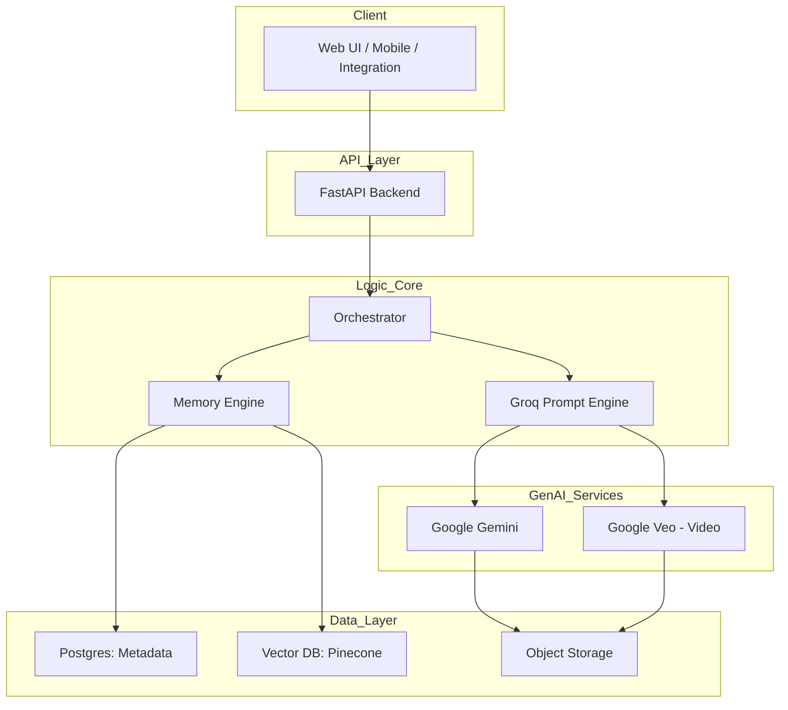

# LORAFRAME (IDLock Engine)

**Persistent Character Memory & Video Generation System**

LORAFRAME is an advanced AI pipeline designed to generate consistent, evolving digital characters. It combines episodic memory, LLM reasoning, and identity-preservation technology to create "permanent digital actors" that remember their past scenes and maintain visual consistency across thousands of generated images and videos.

##  Key Features

*   **Identity Retention (IDLock)**: Leverages InsightFace and semantic vector embeddings to ensure character faces remain consistent across generations.
*   **Episodic Memory**: Characters "remember" previous scenes (context, injuries, clothing changes) via RAG (Retrieval Augmented Generation) and Vector DBs.
*   **Prompt Engine**: Uses **Groq (Llama 3)** to convert simple user prompts into rich, context-aware scene descriptions that respect the character's history.
*   **Multi-Modal Output**: Generates high-quality Images and Videos using **Google Gemini** and **Imagen/Veo** models.
*   **Self-Healing**: Automated "Refiner" loop detects identity drift and repairs faces if they deviate from the character's canonical look.

---

##  Architecture



---

##  Technology Stack

*   **Backend**: Python 3.10+, FastAPI
*   **Database**: PostgreSQL (SQLAlchemy), Redis (Caching/Queues)
*   **Vector Database**: Pinecone / Milvus / FAISS
*   **LLM Inference**: Groq (Llama 3 70B/8B)
*   **Image/Video Gen**: Google Gemini Pro Vision, Imagen 2, Veo
*   **Computer Vision**: InsightFace, ONNX Runtime (Identity extraction & IDR validation)
*   **Storage**: Google Cloud Storage (GCS) or AWS S3

---

##  Getting Started

### Prerequisites

*   Python 3.10+
*   PostgreSQL & Redis (or Docker)
*   API Keys:
    *   `GOOGLE_API_KEY` (Gemini/PaLM)
    *   `GROQ_API_KEY`
    *   `PINECONE_API_KEY` (Optional, defaults to local FAISS if not set)

    pip install -r requirements.txt
    


---

## API Documentation

** Live Backend (GCP):** [Online API Docs (Swagger UI)](https://cineai-api-4sjsy6xola-uc.a.run.app/docs)

Detailed endpoint documentation is available in [API_DOCUMENTATION.md](API_DOCUMENTATION.md).

### Core Endpoints

*   `POST /api/v1/characters`: Create a new character from reference images.
*   `POST /api/v1/generate`: Generate a consistent image for a character.
*   `POST /api/v1/video/generate`: Generate a video scene.
*   `GET /api/v1/jobs/{job_id}`: Check generation status.

---

##  Project Structure

```
cineAI/
├── app/
│   ├── api/            # API Routes (characters, generate, video)
│   ├── core/           # Config, Database, Redis setup
│   ├── models/         # SQLAlchemy Database Models
│   ├── schemas/        # Pydantic Request/Response Models
│   ├── services/       # Core Logic (Groq, Gemini, MemoryEngine)
│   └── workers/        # Async Task Workers
├── scripts/            # Utility scripts
├── tests/              # Pytest suite
├── uploads/            # Local storage for dev
├── .env.example        # Environment variable template
├── requirements.txt    # Python dependencies
└── README.md           # This file
```
